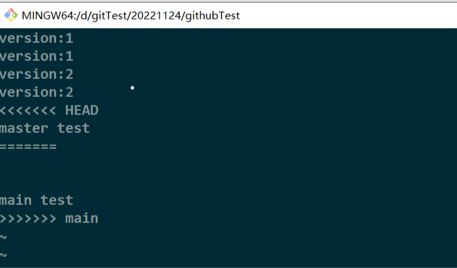

# Git 切换版本，底层其实就是移动HEAD指针进行操作
HEAD指向分支，分支再指向该分支下的版本
## git rm和git rm --cached的区别
git rm 会删除本地和git对该文件的跟踪，后者不会删除本地文件只是取消跟踪
## git reflog
查看简略版本信息
## git log
查看详细版本信息

# 版本穿越
## git reset --hard xxx
xxx为git reflog显示的各个版本前的版本号

## git merge xxx
xxx为将要合并的分支名，是将xxx分支合并到当前所在分支，所以要先切换到主分支进行执行（如果是想把分支合并到主分支上的话）

# 一排小于号HEAD
# 一行等号
# 中间为当前分支该文件内容（也是产生冲突的位置）
# 一行等号
# 到>>>>>>>main
# 中间为main分支下该文件冲突位置内容
修改文件，并把那些小于号大于号======描述信息删除
将修改文件重新添加并提交，此时git commit不能加文件名，不然会报错
